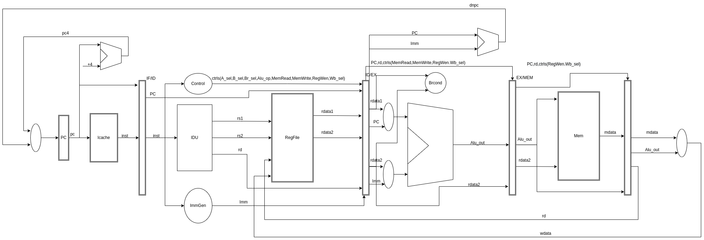

# RISCV CPU
We choose verilog to implement RISCV64  5-stage Pipeline CPU desgined using chisel3.Now it's just a framework.The memory is simluated by cpp code to make tesing easily.
## Feature
- Pipeline
- Data Hazard

=======================


## Getting Started

First, install verilator by referring to the documentation [here](https://github.com/verilator/verilator).
To watch vcd files,gtkwave is nedded.

Generate cpp code and run simulation:
```bash
make run
```

Watch the vcd file:
```bash
make sim
```

## DataPath

